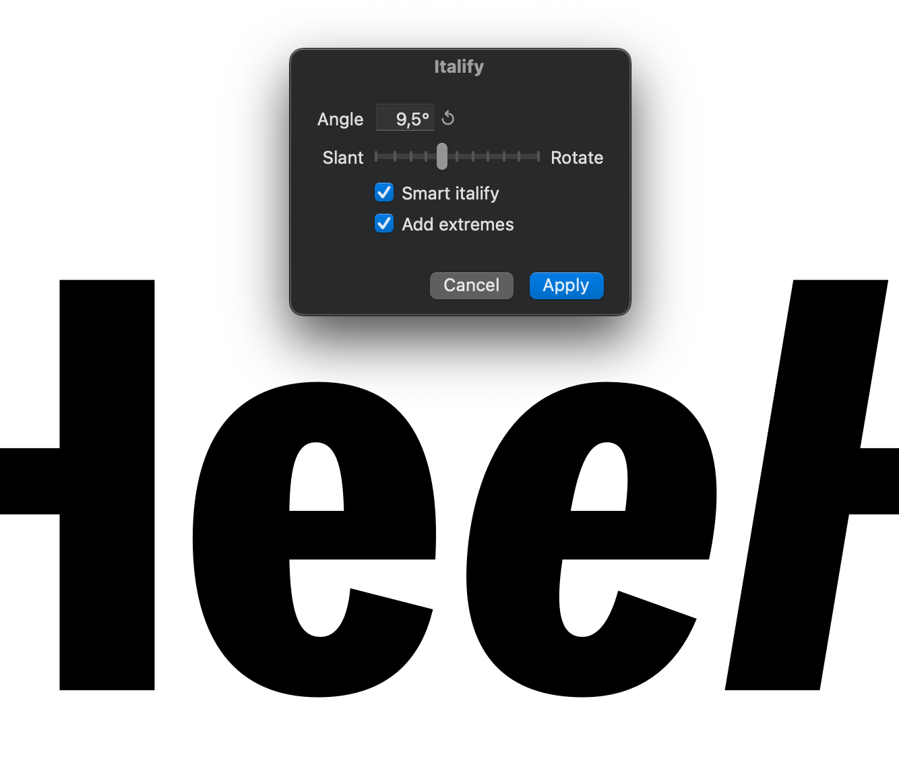

# Italify
Work-in-progress Glyphs 3 plugin to create synthetic italics (best for sans-serif designs). Round segments are slanted/rotated according to the balance set with the slider, straight segments are treated automatically.

!!! VERY BUGGY !!!

Since this plugin is still very much in development, a lot of outlines won't be transformed as expected. **Please add issues here showing your outlines, before and after filter application**. This helps me figure out what's going on and hopefully improve the filter logic.

## How does Italify work?
- Using the slider, you can define a ratio of slant and rotate that will be applied to the entire outline.

## What is Smart Italify?
- Round and straight segments are treated indepently of each other.
- Round segments are slanted and rotated, like in simple italify.
- Straight segments are slanted and rotated at an independent amount: perfectly vertical segments are only rotated, while perfectly horizontal segments are only slanted. This **perfectly preserves stem weight** and thus contrast. Additionally, horizontal elements (like the crossbar of an e, or terminals) stay horizontal.

Please reach out if you know how to best incorporate removal of italic extremes :)

